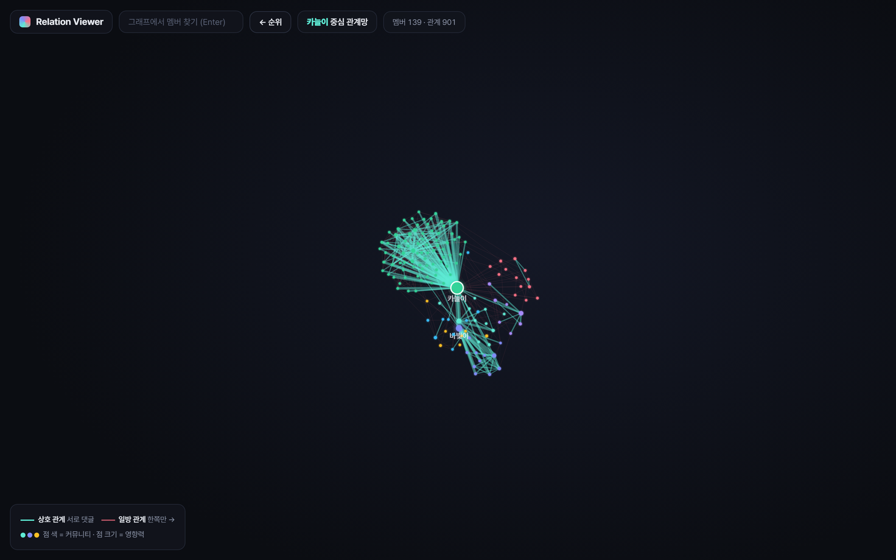
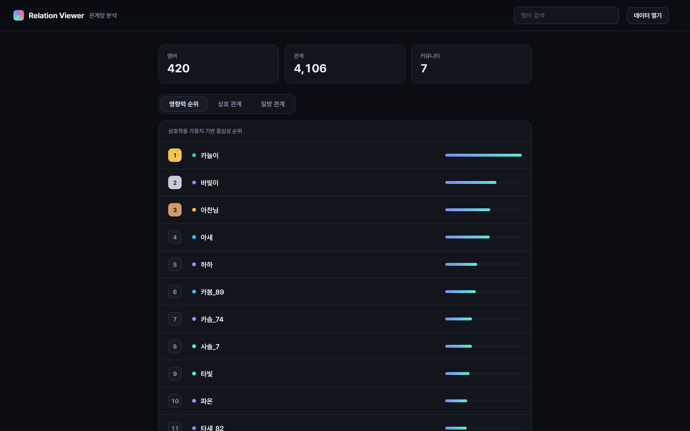
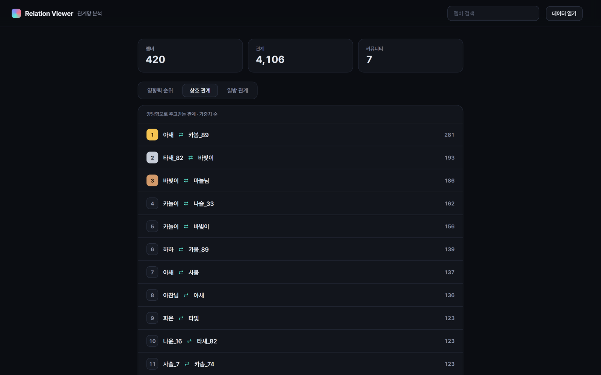
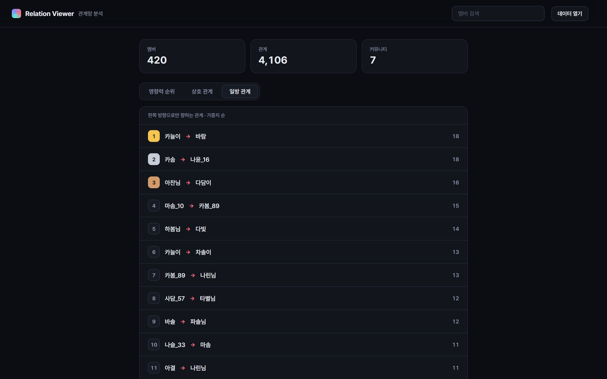
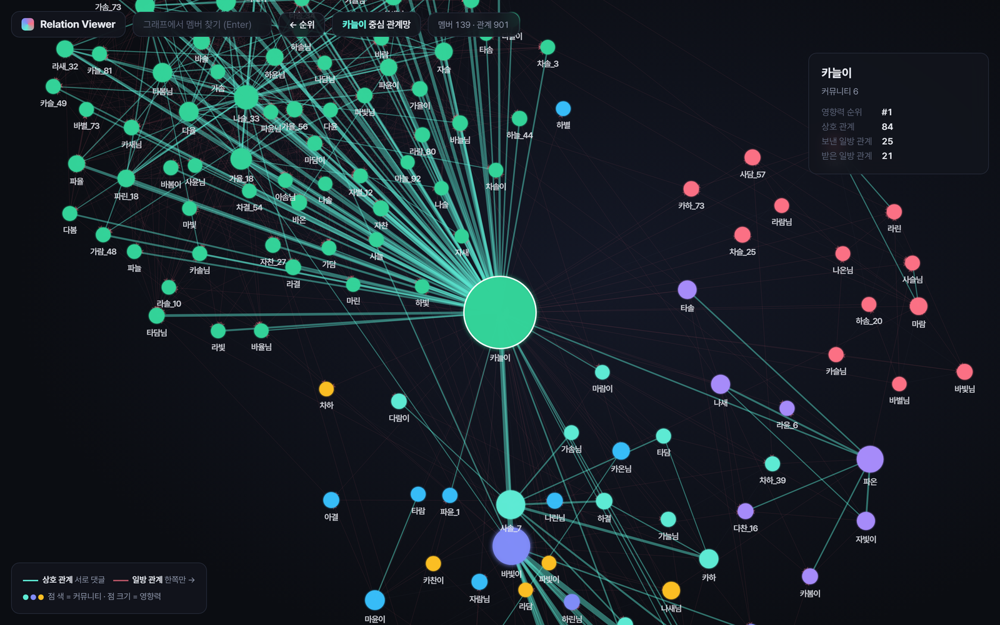

# Relation Viewer

"누가 누구에게 얼마나" 반응했는지만 있으면 커뮤니티의 **관계망**을 그려 주는 도구입니다.
영향력 순위, 서로 주고받는 관계, 한쪽만 향하는 관계, 사람 중심의 관계 그래프를 브라우저에서 바로 볼 수 있습니다.



> README의 모든 스크린샷은 `examples/` 의 **가상 데이터**(실존 인물 없음)로 찍었습니다.

## 실제 규모에서 검증

실제 온라인 커뮤니티의 약 11년치 상호작용 기록으로 검증했습니다.

| 입력 상호작용 | | 분석 결과 | |
|---|---:|---|---:|
| 게시글 | 약 27만 | 관계망 노드 | **21,224명** |
| 댓글 | 약 45만 | 관계 | **54,940개** |
| 멘션 | 약 12만 | 커뮤니티 | 16개 |

수만 명 규모 그래프도 뷰어에서 사람 단위로 끊어 보기 때문에 브라우저에서 무리 없이 열립니다.
실제 데이터는 개인정보라 저장소에 포함하지 않습니다.

## 화면

| 영향력 순위 | 상호 관계 |
|---|---|
|  |  |
| **일방 관계** | **멤버 상세** |
|  |  |

- **영향력 순위**: 주고받은 상호작용 가중치의 합(가중 연결도)으로 매긴 중심성 순위
- **상호 관계**: 양쪽 방향 모두 일정 이상 반응한 쌍
- **일방 관계**: 한쪽만 반응하는 쌍 (화살표 방향 보존)
- **사람 중심 그래프**: 이름을 누르면 그 사람과 직접 연결된 사람들만 모아 그립니다. 점 색은 커뮤니티, 점 크기는 영향력입니다.
- 그래프에서 사람을 누르면 상호·보낸·받은 관계 수와 순위를 보여 줍니다.
- 그래프 JSON 파일을 화면에 끌어다 놓거나 **데이터 열기**로 고르면 그 데이터로 바로 열립니다.
- 데이터 파일이 바뀌면 8초 안에 화면이 자동으로 갱신됩니다.

## 빠른 시작

```bash
pip install -r requirements.txt
python -m http.server 8765 --directory viewer
```
`http://localhost:8765` 에 접속하면 예제 데이터(`viewer/data/sample_graph.json`)가 열립니다.

## 내 데이터로 보기

상호작용 기록을 CSV 로 만들고 변환기를 돌리면 `viewer/data/graph_data.json` 이 생기고, 뷰어가 이 파일을 먼저 엽니다.

```bash
python src/from_csv.py interactions.csv --nodes nodes.csv --me <내 id>
```

`interactions.csv`
```csv
source,target,weight,type
u001,u002,1,directed
u001,u007,3,directed
u002,u005,0.5,undirected
```
- 한 줄이 반응 한 번입니다. 같은 쌍이 여러 줄이면 합산합니다.
- `weight` 는 반응의 세기입니다(생략하면 1). 예: 댓글 1, 멘션 3
- `type` 이 `undirected` 이면 방향 없는 접점(같은 글에 함께 댓글 등)이고, 생략하면 `directed` 입니다.
`nodes.csv` (선택): `id,name`

메신저 답장, 커뮤니티 댓글, 협업 도구 멘션처럼 "누가 누구에게" 가 남는 기록이면 무엇이든 됩니다.
예제 데이터는 `python examples/make_sample.py` 로 다시 만들 수 있습니다.

### 관계를 판정하는 방법 (`src/graphkit.py`)
1. 쌍마다 방향별 가중치를 더합니다.
2. 양쪽 방향이 모두 `MUTUAL_MIN` 이상이면 **상호**, 한쪽만 `TAU` 이상이면 **일방**, 합계만 넘으면 **약한 접점**입니다.
3. 사람마다 강한 관계 상위 `TOPK_EDGES` 개만 남기고, 연결이 `MIN_DEGREE` 보다 적은 사람은 뺍니다. 허브 한 명에게 선이 몰려 그래프가 뭉개지는 것을 막기 위해서입니다.
4. 가중 연결도로 중심성(0~1)과 순위를 매기고, Louvain 알고리즘으로 커뮤니티를 나눕니다.

### 뷰어 데이터 형식
```json
{
  "nodes": [{"id": "u001", "name": "이름", "community": 0, "centrality": 0.83, "rank": 1, "size": 55.8, "is_me": false}],
  "links": [{"source": "u001", "target": "u002", "weight": 12.5, "kind": "mutual"}],
  "meta":  {"members": 1, "links": 1, "communities": 1}
}
```
`kind` 는 `mutual` / `oneway` / `weak` 중 하나이고, `oneway` 는 source → target 방향입니다.

## 다른 데이터 연결하기

어떤 서비스든 상호작용을 모아 `graphkit.build_graph()` 에 넘기면 됩니다.
`directed` 에 `{(보낸 사람, 받은 사람): 가중치}`, 필요하면 `undirected` 에 방향 없는 접점을 넣고 `graphkit.write()` 로 저장하면 뷰어가 바로 읽습니다.

## 구조

```
viewer/              뷰어 (정적 HTML, 서버 불필요)
  index.html         순위·상호·일방 관계
  graph.html         사람 중심 관계 그래프
  loader.js          데이터 불러오기 (URL / 끌어다 놓기 / 기본 파일)
  data/              sample_graph.json (예제), graph_data.json (내 데이터, 커밋 안 됨)
src/
  graphkit.py        상호작용 가중치 → 관계망 (출처 무관 핵심 로직)
  from_csv.py        CSV → 뷰어 데이터
examples/            가상 예제 데이터 생성기
```

## 개인정보

- 내 데이터로 만든 결과(`data/`, `viewer/data/graph_data.json`)는 `.gitignore` 로 커밋에서 빠집니다.
- 다른 서비스의 데이터를 수집할 때는 그 서비스의 이용약관과 개인정보 관련 법을 지켜 주세요.
- 뷰어를 외부에 공개할 때는 `--directory viewer` 로 뷰어 폴더만 서빙하세요. 실명이 들어 있는 데이터는 공개하지 않는 것을 권합니다.
